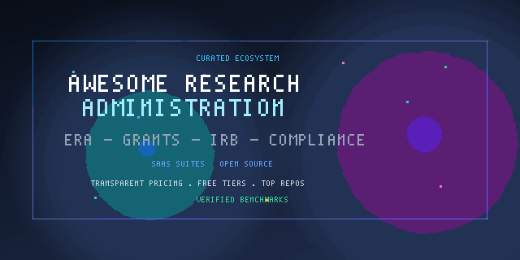

  

  
  
  
  
  
  
  

---

# 🏛️ Awesome Research Administration & eRA Ecosystem

> **A curated, authoritative directory of enterprise SaaS suites and open-source systems powering higher education, academic medical centers, and research institutes.**  
> *Focusing on Electronic Research Administration (eRA), Grants Management Systems (GMS), Pre-Award/Post-Award tracking, IRB/IACUC Compliance, Conflict of Interest (COI), and Research Information Management (RIM).*

---

## 📑 Table of Contents

- [🔍 Overview & Domain Scope](#-overview--domain-scope)
- [🌐 Market Dynamics & Industry Landscape](#-market-dynamics--industry-landscape)
- [💼 Enterprise SaaS Platforms](#-enterprise-saas-platforms)
  - [📊 SaaS Platforms Comparison Table](#-saas-platforms-comparison-table)
  - [🏢 In-Depth SaaS Profiles](#-in-depth-saas-profiles)
- [🔓 Open-Source GitHub Projects](#-open-source-github-projects)
  - [⭐ Open-Source Ranked by GitHub Stars](#-open-source-ranked-by-github-stars)
  - [💻 Open-Source Repository Details](#-open-source-repository-details)
- [🧩 Research Administration Functional Matrix](#-research-administration-functional-matrix)
- [🤝 How to Contribute](#-how-to-contribute)
- [📈 Star History](#-star-history)
- [⚖️ Regulatory & Institutional Disclaimer](#️-regulatory--institutional-disclaimer)

---

## 🔍 Overview & Domain Scope

**Research Administration** encompasses the operational, financial, and regulatory infrastructure that sustains academic and institutional discovery. From the initial discovery of funding opportunities to final financial audit closeouts, research institutions rely on sophisticated software suites to manage complex lifecycles:

* **🎯 Pre-Award & Proposal Development**: Opportunity searching, budget building, institutional routing, approval workflows, and System-to-System (S2S) submission to federal portals (e.g., Grants.gov, NIH ASSIST, NSF Research.gov).
* **💰 Post-Award & Sponsored Accounting**: Grant accounts setup, expense tracking, invoice generation, effort certification, subaward monitoring, and financial closeout.
* **⚖️ Regulatory Compliance & Ethics**: Institutional Review Board (IRB/human subjects), Institutional Animal Care and Use Committee (IACUC), Biosafety (IBC), and Financial Conflict of Interest (FCOI) tracking under Uniform Guidance (2 CFR 200).
* **🔬 Research Information Management (RIM) / CRIS**: Scholar profiling, automated publication ingestion, Open Access compliance monitoring, and institutional research analytics.

---

## 🌐 Market Dynamics & Industry Landscape

> [!NOTE]  
> 🌐 **Market Size & Structure Analysis**: The global **Electronic Research Administration (eRA) and Grants Management Software** sector is estimated at **$2.05 Billion to $3.07 Billion** as of 2025/2026, and is projected to expand to **$4.0 Billion to $8.0+ Billion** by 2033–2035 at an estimated Compound Annual Growth Rate (CAGR) of **10.2% – 12.4%**.  
> The sector is **moderately-to-highly fragmented** rather than concentrated into a winner-take-all monopoly: enterprise suites (such as InfoEd, Huron, Cayuse, and Streamlyne) compete directly for R1/R2 universities, while specialized platforms dominate specific critical verticals (Clarivate/Pivot-RP in funding intelligence, WCG/IRBNet in human subject ethics review, OpenWater in review/awards, and Digital Science/Symplectic in research profiling). Extremely high switching costs, intricate ERP integrations (Workday, SAP, Oracle Banner), and deep federal regulatory compliance prevent single-vendor dominance.

---

## 💼 Enterprise SaaS Platforms

Below is the structured analysis of top commercial research administration software suites, sorted in **descending order by company size (Revenue / Valuation)**.

### 📊 SaaS Platforms Comparison Table

| Platform | Core Capabilities & Verticals | Company Size (Revenue / Valuation) | Pricing (Starting Tier) | Free Tier & Free Trial Limits |
| :--- | :--- | :--- | :--- | :--- |
| **[eRA Commons](https://www.era.nih.gov/)** | Federal NIH/HHS electronic grant application validation, JIT, RPPR progress reports, and post-award closeout | **$48.0B+** annual agency budget (NIH extramural grant portfolio exceeds **$35B/year**) | **$0 / Free** (100% taxpayer-funded public federal service for grant recipients) | **Free forever plan**: Unlimited grant tracking and RPPR submissions; strictly limited to NIH/HHS federal awards; requires institutional Signing Official (SO) registration & SAM.gov UEI validation |
| **[Pivot-RP](https://pivot.proquest.com/)** | Global funding opportunity database, research intelligence, grant alerting, and scholar profiling | **$3.5B+** valuation / **$2.63B** annual revenue (Clarivate Plc — NYSE: `CLVT`) | **$6,500 / year** (Starting entry institutional tier for small colleges; mid-to-large universities range $12,000–$25,000/yr) | **30-day to 120-day (up to 4 months) institutional trial** upon administrator request: Full access to global funding database, automated alerts, and trial profile indexing for up to 50 faculty |
| **[IRBNet](https://www.irbnet.org/)** | Electronic IRB protocol review, IACUC animal tracking, Biosafety (IBC), and regulatory compliance management | **$3.5B+** valuation / **~$500M** annual revenue (WCG Clinical / Arsenal Capital & LGP) | **$15,000 / year** (Starting annual license for community hospitals & small colleges; larger medical centers scale to $45,000–$80,000+/yr) | **30-day guided pilot & demo sandbox** upon institutional consultation: Test committee setup, 5 sample protocol submissions, and coordinator training sandbox access |
| **[Huron Research Suite](https://www.huronconsultinggroup.com/)** | Enterprise-wide comprehensive eRA suite (Grants, Agreements, IRB, IACUC, COI, Effort Certification) | **$2.1B+** market cap / **$1.45B** annual revenue (Huron Consulting Group — NASDAQ: `HURN`) | **$50,000 / year** (Entry rate for single module like COI or IRB; comprehensive enterprise multi-campus deployments range $350,000–$900,000+/yr) | **30-day guided interactive sandbox** upon formal institutional consultation/RFP: Pre-configured proposal routing, sample IRB workflows, and up to 3 administrator evaluation seats |
| **[Symplectic Elements](https://www.symplectic.co.uk/)** | Research Information Management (RIM/CRIS), automated publication harvesting, Open Access tracking, and grant linkages | **$2.1B+** parent revenue / **~$120M** division revenue (Digital Science / Holtzbrinck Publishing Group) | **$25,000 / year** (Starting entry tier, approx. £20,000/yr for specialized colleges; large research institutions scale to $75,000+/yr) | **30-day institutional evaluation sandbox** on sales qualification: Up to 25 researcher profiles, automated Crossref/Scopus ingestion demo, and repository sync sandbox |
| **[Cayuse](https://cayuse.com/)** | Modular cloud research suite (Cayuse 424 S2S, Sponsored Projects, Human Ethics/IRB, Animal Oversight, Fund Manager) | **$250M+** estimated valuation / **~$50M** annual revenue (Centana Growth Partners) | **$10,707 / year** (Single module starting tier as verified in public university procurement records; full multi-module suites range $38,000–$120,000+/yr) | **14-day to 30-day guided sandbox pilot** upon institutional consultation: Up to 5 administrator/reviewer user accounts, test proposal routing, and mock protocol submission |
| **[OpenWater](https://www.getopenwater.com/)** | Application intake, peer review workflows, grant awards, fellowship management, and scoring rubrics | **$200M+** parent revenue / **~$15M** product unit revenue (Community Brands / Advsol) | **$5,100 / year** (Starting entry tier for single program management; multi-program enterprise tiers range $6,900–$15,000+/yr) | **14-day free trial sandbox** via guided tour: Limited to 1 active sample grant program, 25 test submissions, 3 reviewer scoring accounts, and standard evaluation forms |
| **[InfoEd Global](https://www.infoedglobal.com/)** | Comprehensive enterprise eRA suite (SPIN funding search, Proposal Development, Post-Award, Animal Care, Biosafety) | **~$30M** estimated annual revenue (Independent enterprise eRA vendor) | **$20,000 / year** (Starting entry module license such as SPIN or basic proposal tracking; enterprise suites range $80,000–$250,000+/yr) | **30-day institutional trial** (specifically available for SPIN funding module and guided proposal development sandbox): Up to 10 test accounts and basic keyword filters |
| **[Streamlyne Research](https://www.streamlyne.com/)** | Cloud-native modular eRA suite derived from Kuali Coeus foundations (Pre-Award, Post-Award, IRB, IACUC, COI) | **~$15M** estimated annual revenue (Vivantech Inc.) | **$18,000 / year** (Starting institutional tier for core pre-award or compliance module; full university suites average $45,000–$85,000/yr) | **30-day sandbox pilot** upon institutional consultation: 1 institutional test tenant, up to 10 dummy grant proposals, and sandbox testing of federal S2S routing |
| **[Novelution](https://www.novelution.com/)** | Integrated modular research administration platform (Pre-Award, Non-Financial Agreements, IRB, IACUC, Effort Reporting) | **~$8M** estimated annual revenue (Novelution Corp) | **$25,000 / year** (Starting tier for single compliance or grant routing module at mid-sized colleges; enterprise suites average $60,000–$120,000+/yr) | **30-day tailored institutional walkthrough & test sandbox** on request: Up to 5 test researcher workflows, mock protocol review, and administrator configuration preview |

---

### 🏢 In-Depth SaaS Profiles

#### 1. 🏛️ [eRA Commons](https://www.era.nih.gov/)
* **Category**: Federal Electronic Research Administration Portal
* **Target Audience**: Academic medical centers, universities, and non-profit research organizations applying for or holding NIH and HHS awards.
* **Key Features**: Direct federal verification, Just-In-Time (JIT) submissions, Research Performance Progress Reports (RPPR), Financial Conflict of Interest (FCOI) reporting to NIH, and automated Federal Financial Report (FFR) validation.
* **Pricing & Access**: $0 (publicly funded); restricted to organizations holding active SAM.gov registrations and NIH Signing Official appointments.

#### 2. 🔍 [Pivot-RP](https://pivot.proquest.com/)
* **Category**: Research Funding Intelligence & Faculty Profiles
* **Target Audience**: Institutional research development offices, librarians, and faculty investigators.
* **Key Features**: Proprietary database tracking >$100B in global government and foundation funding; automated researcher profile matching based on published bibliometrics; custom newsletters and grant opportunity dissemination.

#### 3. ⚖️ [IRBNet](https://www.irbnet.org/)
* **Category**: Research Compliance & Committee Review
* **Target Audience**: Hospital systems, academic IRBs, IACUC committees, and biosafety review boards.
* **Key Features**: Compliant with FDA 21 CFR Part 11 and HHS 45 CFR 46 (Common Rule); electronic signature capture; automated agenda creation; letter generation; board voting and protocol audit trails.

#### 4. 🎓 [Huron Research Suite](https://www.huronconsultinggroup.com/)
* **Category**: Enterprise Tier-1 Research Administration
* **Target Audience**: Large R1 universities, academic medical systems, and major research consortia.
* **Key Features**: Modular architecture spanning Grants, Agreements, Conflict of Interest, IRB, Animal Care (IACUC), and Safety. Tight bidirectional integration with Workday, Oracle, and SAP financials.

#### 5. 📚 [Symplectic Elements](https://www.symplectic.co.uk/)
* **Category**: Research Information Management (RIM) / Current Research Information System (CRIS)
* **Target Audience**: University libraries, research offices, and provost analytics departments.
* **Key Features**: Automatic publication harvesting from 20+ scholarly sources (Dimensions, Web of Science, Scopus, PubMed, Crossref, arXiv); Open Access compliance tracking; assessment reporting for national exercises (e.g., REF).

#### 6. 🚀 [Cayuse](https://cayuse.com/)
* **Category**: Comprehensive Cloud Research Platform
* **Target Audience**: Emerging research institutions through large R1 universities.
* **Key Features**: System-to-System (S2S) submission via Cayuse 424; unified researcher portal; integrated fund manager accounting; conflict of interest reporting; veterinary/animal procurement tracking.

#### 7. 🏆 [OpenWater](https://www.getopenwater.com/)
* **Category**: Awards, Fellowships & Internal Grants Platform
* **Target Audience**: University seed grant programs, academic associations, and philanthropic foundations.
* **Key Features**: Multi-stage review workflows; blinded scoring rubrics; applicant portal; panel discussion management; automated notifications and award letters.

#### 8. 🌐 [InfoEd Global](https://www.infoedglobal.com/)
* **Category**: Full-Lifecycle Electronic Research Administration
* **Target Audience**: Research universities, healthcare networks, and independent research institutes.
* **Key Features**: SPIN (Sponsored Programs Information Network) funding engine; Proposal Development; Award Tracking; Financial COI; Human Protocol & Biosafety Management.

#### 9. ⚡ [Streamlyne Research](https://www.streamlyne.com/)
* **Category**: Modern Cloud-Native eRA
* **Target Audience**: Mid-sized to large universities seeking lower total cost of ownership.
* **Key Features**: Built upon the open-source Kuali Coeus data model but delivered as a high-availability SaaS solution; intuitive drag-and-drop form builders; pre- and post-award routing; AI-assisted agreement review.

#### 10. 📋 [Novelution](https://www.novelution.com/)
* **Category**: Configurable Research Administration
* **Target Audience**: Mid-sized research universities and growing sponsored programs offices.
* **Key Features**: Highly customizable form engines; Non-Financial Agreements (NFAs, DUAs, MTAs) tracking; Effort Certification; comprehensive IRB and IBC committee modules.

---

## 🔓 Open-Source GitHub Projects

While enterprise eRA suites are predominantly commercial due to stringent federal submission schemas and audit requirements, a robust open-source ecosystem powers institutional research data repositories, grant discovery, and researcher networking.

### ⭐ Open-Source Ranked by GitHub Stars

The repositories below are **strictly ranked in descending order by GitHub star counts**. Each badge reflects live repository stars and links directly to the project's stargazers page:

| # | Repository | Category & Domain | GitHub Stars Badge (Live Link) | License | Primary Stack |
| :-: | :--- | :--- | :---: | :---: | :--- |
| **1** | **[DSpace/DSpace](https://github.com/DSpace/DSpace)** | Institutional Research Repository Platform |  | BSD-3-Clause | Java, Angular |
| **2** | **[IQSS/dataverse](https://github.com/IQSS/dataverse)** | Research Data Management & Data Sharing |  | Apache-2.0 | Java, Jakarta EE, React |
| **3** | **[pkp/ojs](https://github.com/pkp/ojs)** | Scholarly Publishing & Peer Review Admin |  | GPL-2.0 | PHP, Vue.js |
| **4** | **[usdigitalresponse/usdr-gost](https://github.com/usdigitalresponse/usdr-gost)** | Grants Identification & Management Tool |  | MIT | Python, React, PostgreSQL |
| **5** | **[vivo-project/VIVO](https://github.com/vivo-project/VIVO)** | Researcher Profile & Networking System |  | BSD-3-Clause | Java, RDF/SPARQL |
| **6** | **[samvera/hyrax](https://github.com/samvera/hyrax)** | Digital Research Asset Repository Framework |  | Apache-2.0 | Ruby on Rails, Solr |
| **7** | **[HHS/simpler-grants-gov](https://github.com/HHS/simpler-grants-gov)** | Modern Federal Grant Discovery & Application |  | CC0-1.0 | TypeScript, Next.js |
| **8** | **[inveniosoftware/invenio-app-rdm](https://github.com/inveniosoftware/invenio-app-rdm)** | Turnkey Research Data Management (CERN/Zenodo) |  | MIT | Python, Flask, React |
| **9** | **[kuali/kc](https://github.com/kuali/kc)** | Open Higher-Ed eRA Suite (Kuali Coeus Core) |  | AGPL-3.0 | Java, Spring, Oracle/MySQL |
| **10** | **[HHS/Head-Start-TTADP](https://github.com/HHS/Head-Start-TTADP)** | Federal Grant Administration & TA Tracking |  | CC0-1.0 | JavaScript, Node.js, React |
| **11** | **[eLifePathways/Kotahi](https://github.com/eLifePathways/Kotahi)** | Scholarly Review & Evaluation Management |  | MIT | JavaScript, Node.js, React |
| **12** | **[HHS/OPRE-OPS](https://github.com/HHS/OPRE-OPS)** | Research Operations & Federal Project Tracker |  | CC0-1.0 | JavaScript, React |
| **13** | **[okeefedaniel/harbor](https://github.com/okeefedaniel/harbor)** | Open-Source Grants Lifecycle Management Suite |  | MIT | PHP, Laravel |

---

### 💻 Open-Source Repository Details

#### 1. 🏛️ [DSpace/DSpace](https://github.com/DSpace/DSpace) 
* **Description**: The world’s most widely deployed open-source institutional repository platform. Preserves and distributes digital research output (dissertations, papers, datasets) with Dublin Core metadata and OAI-PMH endpoints.
* **Use Case in Research Admin**: Central clearinghouse for Open Access compliance reporting and institutional scholarship preservation.

#### 2. 📊 [IQSS/dataverse](https://github.com/IQSS/dataverse) 
* **Description**: Developed at Harvard’s Institute for Quantitative Social Science (IQSS). Provides a dedicated platform for archiving, publishing, citing, and exploring research datasets with DOI integration.
* **Use Case in Research Admin**: Satisfies federal funding agency Data Management and Sharing (DMS) policy mandates (e.g., NIH DMS policy).

#### 3. 📰 [pkp/ojs](https://github.com/pkp/ojs) 
* **Description**: Open Journal Systems by the Public Knowledge Project. Full editorial and peer-review workflow engine used by over 30,000 journals worldwide.
* **Use Case in Research Admin**: Manages institutional journal presses and student/faculty peer-reviewed publications.

#### 4. 🎯 [usdigitalresponse/usdr-gost](https://github.com/usdigitalresponse/usdr-gost) 
* **Description**: The Grants Opportunity Search Tool (GOST) built by U.S. Digital Response. Automates federal grant scraping, team assignment, eligibility review, and collaborative decision pipelines.
* **Use Case in Research Admin**: Research development teams monitoring and distributing federal grant opportunities across university departments.

#### 5. 🌐 [vivo-project/VIVO](https://github.com/vivo-project/VIVO) 
* **Description**: Semantic Web application enabling national and cross-institutional discovery of researchers, grants, facilities, and academic scholarship.
* **Use Case in Research Admin**: Open-source alternative to commercial profiling platforms; facilitates cross-disciplinary research team assembly.

#### 6. 🗄️ [samvera/hyrax](https://github.com/samvera/hyrax) 
* **Description**: Front-end repository engine built on Ruby on Rails and the Samvera community stack (Fedora/Solr). Supports complex descriptive metadata schemas.
* **Use Case in Research Admin**: Institutional repository management for specialized clinical, scientific, and cultural research archives.

#### 7. 🇺🇸 [HHS/simpler-grants-gov](https://github.com/HHS/simpler-grants-gov) 
* **Description**: The U.S. Department of Health and Human Services modern open initiative to redesign and simplify federal grant discovery and application workflows.
* **Use Case in Research Admin**: Insight into upcoming federal grant data standards, API contracts, and user-centered grant forms.

#### 8. 🔬 [inveniosoftware/invenio-app-rdm](https://github.com/inveniosoftware/invenio-app-rdm) 
* **Description**: CERN-backed research data management repository platform that powers Zenodo. Highly scalable, FAIR-compliant architecture designed for multi-petabyte institutional deployments.
* **Use Case in Research Admin**: Institutional research output and raw research dataset archiving with automated DOI generation through DataCite.

#### 9. ⚙️ [kuali/kc](https://github.com/kuali/kc) 
* **Description**: Kuali Coeus (KC) open-source core codebase, historically developed in partnership with MIT and university consortia for end-to-end research administration.
* **Use Case in Research Admin**: The definitive open-source reference implementation for institutional pre-award, post-award, IRB, and IACUC data schemas.

#### 10. 📋 [HHS/Head-Start-TTADP](https://github.com/HHS/Head-Start-TTADP) 
* **Description**: System for managing technical assistance, reporting, and activity tracking across federal grant recipient cohorts.
* **Use Case in Research Admin**: Template for post-award training, compliance monitoring, and milestone validation.

#### 11. 📝 [eLifePathways/Kotahi](https://github.com/eLifePathways/Kotahi) 
* **Description**: Modern, open-source submission, peer review, and journal evaluation platform built by the Coko Foundation and supported by eLife.
* **Use Case in Research Admin**: Peer review management for university seed grant competitions and internal awards.

#### 12. 📊 [HHS/OPRE-OPS](https://github.com/HHS/OPRE-OPS) 
* **Description**: Research project tracking system from the Administration for Children and Families (ACF) Office of Planning, Research, and Evaluation.
* **Use Case in Research Admin**: Project milestone, budget allocation, and contractor/grantee task management.

#### 13. ⚓ [okeefedaniel/harbor](https://github.com/okeefedaniel/harbor) 
* **Description**: Lightweight open-source enterprise grants management suite covering opportunity postings, applicant submissions, committee reviews, award letters, and financial closeouts.
* **Use Case in Research Admin**: Ideal blueprint for small research foundations, municipal grantmakers, or departmental internal pilot funding competitions.

---

## 🧩 Research Administration Functional Matrix

| Functional Vertical | Primary Commercial SaaS Leaders | Notable Open-Source Solutions | Key Regulatory / Standards Framework |
| :--- | :--- | :--- | :--- |
| **Federal System-to-System (S2S)** | Cayuse 424, InfoEd Proposal Dev, Huron Grants | HHS Simpler Grants.gov, Kuali KC Core | Grants.gov XML/JSON schemas, NIH ASSIST |
| **Human Subjects Review (IRB)** | IRBNet (WCG), Huron IRB, Cayuse Human Ethics | Kuali KC Protocol Module | HHS 45 CFR 46 (Common Rule), FDA 21 CFR 56 |
| **Animal Care & Use (IACUC)** | Cayuse Animal Oversight, Huron IACUC, Novelution | Kuali KC IACUC Module | USDA Animal Welfare Act, PHS Policy |
| **Financial Conflict of Interest (COI)** | Huron COI, InfoEd FCOI, Streamlyne COI | Kuali KC COI Engine | 42 CFR Part 50 Subpart F, 45 CFR Part 94 |
| **Research Data Management (RDM)** | Figshare for Institutions, Elsevier Pure | Dataverse, InvenioRDM, DSpace | NIH DMS Policy, FAIR Data Principles |
| **Funding Opportunity Discovery** | Clarivate Pivot-RP, InfoEd SPIN | USDR GOST Grants Tool | Federal Grants API, Grants.gov RSS |
| **Research Profiling & RIM** | Symplectic Elements, Clarivate Converis | VIVO Project, DSpace-CRIS | VIVO Ontology, CERIF Standard |

---

## 🤝 How to Contribute

Contributions are warmly welcomed! We invite sponsored programs administrators, compliance directors, and software developers to expand this curated collection:

1. 🍴 **Fork the Repository**: Clone your personal copy from GitHub.
2. 🌿 **Create a Feature Branch**: `git checkout -b add-platform-feature`
3. 📝 **Add/Update Details**:
   - Provide the official URL and clear functional description.
   - For **SaaS platforms**, ensure starting tier prices and exact free trial durations/limits are strictly specified.
   - For **Open-Source projects**, supply the GitHub repo format (`owner/repo`) so live shields.io star badges and stargazer links remain functional.
4. ✅ **Ensure Formatting Consistency**: Maintain alphabetical or star/size ranked ordering.
5. 🚀 **Submit a Pull Request**: Explain the rationale and cite authoritative documentation.

Explore more curated developer lists at **[Awesome-Awesome-Awesome](https://github.com/ishandutta2007/Awesome-Awesome-Awesome)**.

---

## 📈 Star History

---

## ⚖️ Regulatory & Institutional Disclaimer

* This repository is a **community-curated index** created solely for informational, educational, and architectural comparison purposes. Inclusion does not constitute an endorsement, recommendation, or warranty.
* **Regulatory Compliance**: Research administration entails adherence to federal regulations (e.g., Uniform Guidance 2 CFR 200, Common Rule 45 CFR 46, HIPAA, Export Controls EAR/ITAR). Open-source or self-hosted implementations require rigorous independent security vetting, access controls, audit trail verification, and institutional review.
* Always consult your institution’s Office of Sponsored Programs (OSP), Institutional Review Board (IRB), Office of Research Integrity, and General Counsel before procuring or deploying research management software.

---

  <b>Built with care for research administrators, sponsored programs officers, and open science advocates worldwide.</b> 
  Let's keep research administration compliant, efficient, transparent, and accessible.

